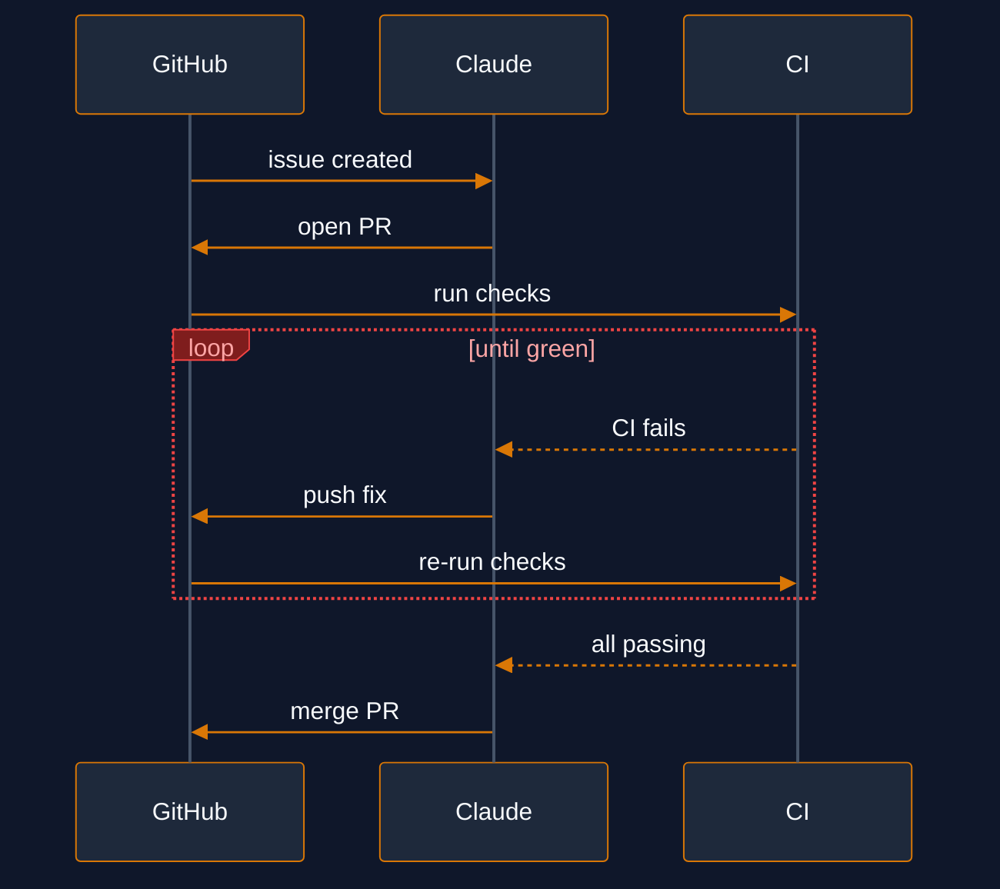

# claude-channels-github

MCP channel server + Claude Code plugin that pushes GitHub events (PRs, CI, issues) into your Claude session in real time.

> **Channels are a Claude Code research preview.** The `--dangerously-load-development-channels` flag is required. Expect rough edges.

## Getting started

### Prerequisites

- [Bun](https://bun.sh) (build from source only)
- [gh CLI](https://cli.github.com) authenticated (`gh auth login`)
- Claude Code with channels support

### Install the binary

Download the latest release (macOS arm64):

```bash
curl -fsSL https://github.com/mikery/claude-channels-github/releases/latest/download/claude-channels-github-darwin-arm64 -O
curl -fsSL https://github.com/mikery/claude-channels-github/releases/latest/download/claude-channels-github-darwin-arm64.sha256 -O
shasum -a 256 -c claude-channels-github-darwin-arm64.sha256
install -m 755 claude-channels-github-darwin-arm64 /usr/local/bin/claude-channels-github
rm claude-channels-github-darwin-arm64 claude-channels-github-darwin-arm64.sha256
```

Or build from source:

```bash
git clone https://github.com/mikery/claude-channels-github.git
cd claude-channels-github
bun install
bun build --compile gh-channel.ts --outfile claude-channels-github
install claude-channels-github /usr/local/bin/
```

### Install the plugin

Add the marketplace and install:

```bash
claude plugin marketplace add github:mikery/claude-channels-github
claude plugin install gh-channels
```

The plugin bundles the MCP server config, slash commands, and orchestration skills. No separate MCP configuration needed.

### Run

```bash
claude --dangerously-load-development-channels server:gh-channels
```

The `server:gh-channels` flag loads the channel listener, which is required for real-time event push. The plugin provides the MCP tools and commands.

### First watch

```
> /watch-pr 42
```

Claude will poll the PR every 30 seconds and report reviews, CI changes, comments, and merge readiness.

## What it does

You assign an issue. Claude creates a worktree, writes the fix, opens a PR, watches CI, fixes failures, and merges — all without you touching it.

<p align="center">
  
</p>

Under the hood, a poll-based MCP server watches GitHub for events (reviews, CI state changes, new issues, merge conflicts) and pushes them into Claude's session as channel notifications. A plugin layer adds slash commands and orchestration skills that turn those notifications into autonomous workflows.

**Channel server**

| Tool | Watches for | Auto-stops |
|------|------------|------------|
| `watch_pr` | Reviews, CI, comments, conflicts, merge state | On merge or close |
| `watch_ci` | Check run state changes (terminal only) | When all checks finish |
| `watch_issues` | New issues, label changes, closures | Manual (`stop_watching`) |
| `watch_prs` | New PRs, ready-to-merge transitions | Manual (`stop_watching`) |
| `stop_watching` | — | Stops a watch by key |
| `list_watches` | — | Lists active watches |

All poll-based tools accept an optional `poll_interval` (seconds, default: 30).

**Plugin**

| Commands | |
|----------|--|
| `/watch-pr <number>` | Watch a single PR |
| `/watch-ci <ref>` | Watch CI on a branch or SHA |
| `/watch-issues [--labels a,b]` | Watch for new issues |
| `/watch-prs [--labels a,b]` | Watch for new PRs |
| `/watches` | List active watches |
| `/stop-watch <key>` | Stop a watch |

| Skills | |
|--------|--|
| `pr-handler` | Handle a single PR to merge: respond to reviews, fix CI, resolve conflicts, merge when ready |
| `issue-handler` | Watch for new issues, create worktrees, open PRs, dispatch `pr-handler` for each, merge on green |

## Authentication

Two options:

| Method | Setup |
|--------|-------|
| **gh CLI** (recommended) | Set `GH_CHANNEL_USE_GH_AUTH=1` in `.mcp.json` env. Requires `gh auth login`. |
| **Token** | Set `GITHUB_TOKEN` env var. Needs `repo` scope. |

## Environment variables

| Variable | Default | Description |
|----------|---------|-------------|
| `GITHUB_TOKEN` | — | GitHub API token (alternative to gh CLI) |
| `GH_CHANNEL_USE_GH_AUTH` | — | Set to `1` to use `gh auth token` |
| `GH_CHANNEL_LOG_LEVEL` | `info` | Pino log level: `debug`, `info`, `warn`, `error` |
| `GH_CHANNEL_LOG` | `/tmp/gh-channel.log` | Log file path |

## Architecture

**Single file** (`gh-channel.ts`), compiled to a standalone binary with Bun.

**WatchRunner** is the core abstraction — a generic polling engine that manages watch lifecycle:

- **States**: polling → paused → stopped
- **Scheduling**: `setTimeout`-based, no overlapping polls
- **Error handling**: 5 consecutive failures → auto-stop with notification
- **Rate limits**: Tracks `x-ratelimit-remaining` via Octokit hook. Pauses all polls at 20 remaining, warns at 100, resumes after reset timestamp

Each watch type (PR, CI, issues, PRs) provides a `createState()` + `poll(state, initial)` function. The runner handles scheduling, error counting, and notification delivery.

**Key design choices:**

- **Terminal CI states only** — no queued/in_progress noise. Notifies when checks conclude.
- **One notification per review** — reviews are a logical unit. Inline comments bundled with diff hunks.
- **Merge conflict on transition** — notifies when conflict appears *and* when it resolves.
- **Ready-to-merge uses GitHub's `mergeable_state`** — relies on GitHub's own branch protection evaluation rather than custom logic. Requires two consecutive `clean` readings to avoid transient states.
- **Initial poll sends snapshot** — first poll seeds state and sends a status summary so Claude has full context.

## License

MIT
